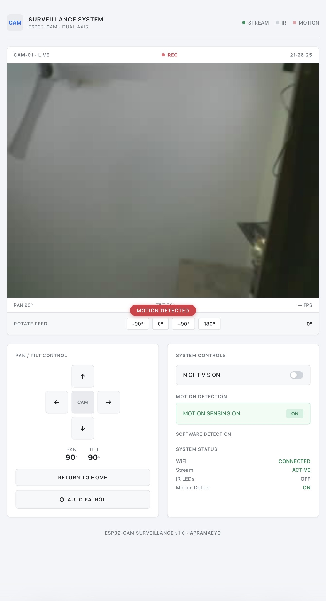
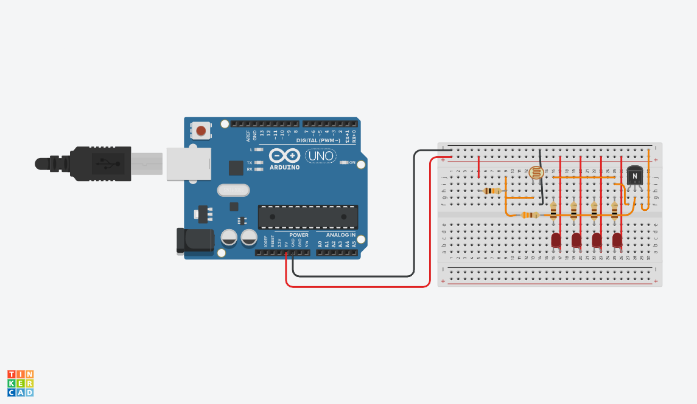

# ESP32-CAM-CCTV-Surveillance
Dual-axis pan/tilt CCTV system with live MJPEG streaming, night vision, motion detection and web control - built on ESP32-CAM

## Features

- Live MJPEG streaming
- Pan/Tilt camera control
- Auto patrol mode
- Software motion detection
- Automatic IR night vision
- Battery powered
- Custom PCB
- 3D printed casing

## Hardware

- ESP32-CAM
- MG90S Servos
- LDR
- 850/940nm IR LEDs
- 2×18650 Battery
- DC-DC Buck converter
- ESP32 CAM MB/FTDI MODULE

## Software

- Arduino IDE
- C/C++
- HTML/CSS/JavaScript

## Demo

### Finished Project

### Live Web Interface

### PCB Design

### Night Vision

## Future Improvements

- Telegram notifications
- Face detection
- Mobile application
- Cloud recording
